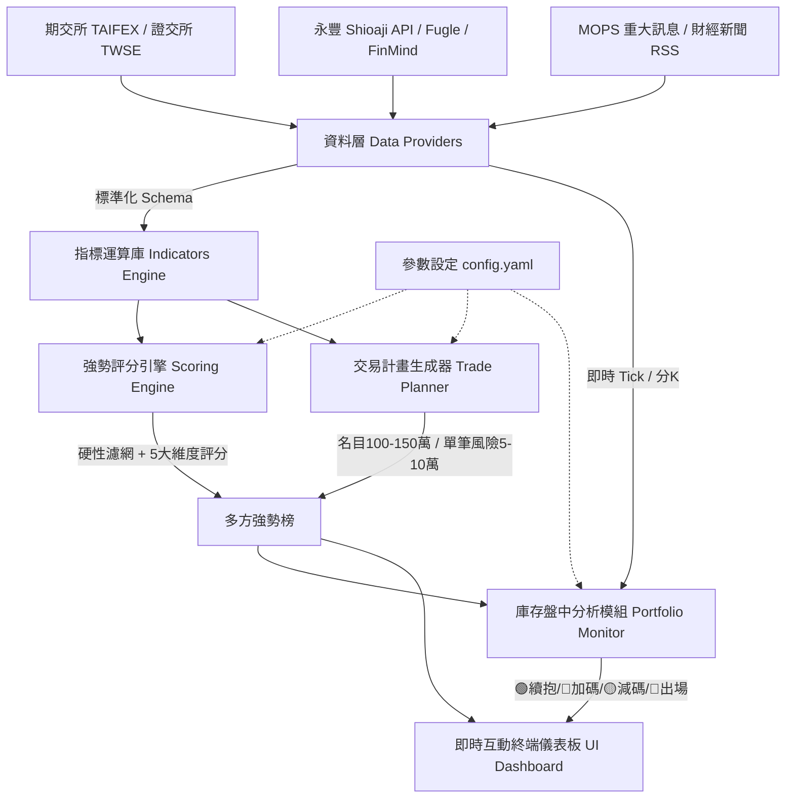

# 台股「個股期貨」強勢排名 + 庫存盤中分析系統 — Implementation Plan

> 版本：v1.0 (已依實盤資金與偏好客製化)  
> 基準規範：[antigravity_stock_futures_prompt.md](file:///d:/00.GEMINI%E5%8D%94%E4%BD%9C/%E8%82%A1%E6%9C%9F%E5%88%86%E6%9E%90%E8%BB%9F%E9%AB%94%E9%96%8B%E7%99%BC/antigravity_stock_futures_prompt.md)  
> 產出日期：2026-10-07

---

## 1. 使用者實盤設定與需求確認

本系統依據您的實盤配置進行專屬參數調校：
1. **主要券商 API**：**永豐金證券 Shioaji API**（提供個股期貨即時 Tick、分K、五檔、成交量與未平倉量 OI）。
2. **交易策略重心**：**專注「多方強勢榜」**（做多強勢多頭排列、帶量突破與回測支撐標的）。
3. **資金規模與風控模型**：
   - **帳面控制名目合約總值 (Notional Value)**：**NT$ 100 萬 ～ 150 萬**（例如以標的現價 550 元為例，標準型 1 口 2,000 股名目市值約 110 萬）。
   - **實際投入原始保證金**：**約 NT$ 40 萬**（保證金使用率維持在穩健安全水位）。
   - **單筆交易最大允許虧損**：**NT$ 5 萬 ～ 10 萬**（預設 NT$ 60,000，確保單筆停損不傷及本金）。
   - **最低風報比要求 (R:R)**：**≥ 1.5**。

---

## 2. 系統架構與模組設計

---

## 3. 五大維度強勢評分模型 (滿分 100 分)

- **A. 趨勢結構 (25 分)**：現價 > 5MA > 10MA > 20MA > 60MA 多頭排列、創波段與 52 週新高。
- **B. 相對強度 (25 分)**：RS Rating 百分位 PR 值、超越台股加權指數之超額報酬 (Alpha)。
- **C. 動能與趨勢 (15 分)**：ADX(14) > 25、MACD 零軸上擴張、RSI(14) 55~80 健康區間（>85 標記過熱扣分）。
- **D. 量價與波動 (15 分)**：當日量比 ≥ 1.5、價漲量增、VCP 波動收斂突破型態。
- **E. 籌碼與期貨 OI (20 分)**：三大法人連續買超、**價漲 + 期貨未平倉量 (OI) 增加（多方增倉最強訊號）**。
- **基本面加成 (最高 10 分)**：連續 3 個月營收年增 > 20% 加分。

---

## 4. 庫存部位盤中四大訊號燈邏輯

| 訊號燈 | 觸發條件 | 系統建議動作 |
| :--- | :--- | :--- |
| 🟢 **續抱** | 現價穩居 20MA 與 VWAP 之上，未破停損點 | 多方趨勢完整，安心續抱讓利潤奔馳 |
| 🔵 **可加碼** | 回測 VWAP 不破並再度放量攻高，且加碼後 R:R ≥ 1.5 | 支撐確立，可依口數上限加碼 1 口 |
| 🟡 **減碼 / 上移停損** | 獲利達 1.5R~2R 或爆量長上影力竭訊號 | 分批獲利入袋 1/3，並將停損上移至進場成本價（保本） |
| 🔴 **立即出場** | 盤中跌破設定停損價或放量跌破關鍵均線 | 嚴守紀律停損，控制單筆虧損在 5~10 萬預算內 |

---

## 5. 檔案結構全覽

- **決策終端主介面**：[index.html](file:///d:/00.GEMINI%E5%8D%94%E4%BD%9C/%E8%82%A1%E6%9C%9F%E5%88%86%E6%9E%90%E8%BB%9F%E9%AB%94%E9%96%8B%E7%99%BC/index.html)
- **終端樣式系統**：[dashboard.css](file:///d:/00.GEMINI%E5%8D%94%E4%BD%9C/%E8%82%A1%E6%9C%9F%E5%88%86%E6%9E%90%E8%BB%9F%E9%AB%94%E9%96%8B%E7%99%BC/dashboard.css)
- **量化評分與風控引擎**：[dashboard.js](file:///d:/00.GEMINI%E5%8D%94%E4%BD%9C/%E8%82%A1%E6%9C%9F%E5%88%86%E6%9E%90%E8%BB%9F%E9%AB%94%E9%96%8B%E7%99%BC/dashboard.js)
- **集中參數設定檔**：[config.yaml](file:///d:/00.GEMINI%E5%8D%94%E4%BD%9C/%E8%82%A1%E6%9C%9F%E5%88%86%E6%9E%90%E8%BB%9F%E9%AB%94%E9%96%8B%E7%99%BC/config.yaml)
- **API 申請與設定清單**：[API_SETUP_GUIDE.md](file:///d:/00.GEMINI%E5%8D%94%E4%BD%9C/%E8%82%A1%E6%9C%9F%E5%88%86%E6%9E%90%E8%BB%9F%E9%AB%94%E9%96%8B%E7%99%BC/API_SETUP_GUIDE.md)
- **環境變數範本**：[.env.example](file:///d:/00.GEMINI%E5%8D%94%E4%BD%9C/%E8%82%A1%E6%9C%9F%E5%88%86%E6%9E%90%E8%BB%9F%E9%AB%94%E9%96%8B%E7%99%BC/.env.example)
- **完整使用手冊**：[README.md](file:///d:/00.GEMINI%E5%8D%94%E4%BD%9C/%E8%82%A1%E6%9C%9F%E5%88%86%E6%9E%90%E8%BB%9F%E9%AB%94%E9%96%8B%E7%99%BC/README.md)
